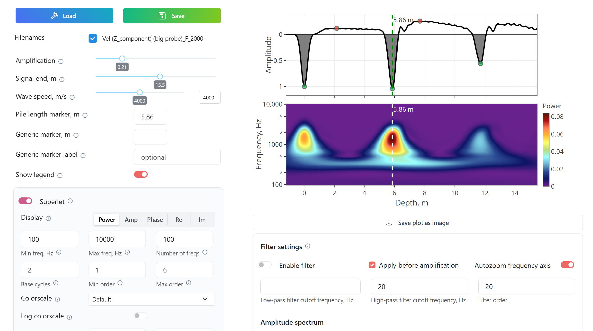

# echopile

[](https://pypi.org/project/echopile/)
[](https://pypi.org/project/echopile/)

`echopile` is a Python application with a graphical user interface for processing and interpretation of low-strain impact pile integrity testing data (sonic echo method), with support for superlet-based time-frequency analysis. The interface is built on [Dash](https://dash.plotly.com/).

Links: [PyPI](https://pypi.org/project/echopile/) | [GitHub repository](https://github.com/ilozovsky/echopile) | [Releases](https://github.com/ilozovsky/echopile/releases) | [GitHub Discussions](https://github.com/ilozovsky/echopile/discussions)

Documentation is provided directly in the application via info boxes for each feature.

Questions are welcome in GitHub Discussions. Direct contact: `i.n.lozovsky@gmail.com`



## Installation

Requirements: Python 3.10+

Install from PyPI:

```bash
pip install echopile
```

Optional SEG-Y support:

```bash
pip install "echopile[segy]"
```

Install from source:

```bash
pip install .
```

## Quick start

Run the application:

```bash
echopile
```

or:

```bash
python -m echopile
```

The interface opens at:

`http://127.0.0.1:8050`

### First run

1. Start `echopile`.
2. Load the example file [`Vel (Z_component) (big probe)_F_2000.snc`](examples/Vel%20(Z_component)%20(big%20probe)_F_2000.snc).

## Features

### Signal processing

- Exponential amplitude correction
- Signal trimming and tail shaping
- Linear detrending and constant baseline correction
- Polarity inversion
- Automatic signal shifting to the earliest detected reference peak
- Downsampling with optional anti-alias filtering
- Time-domain and frequency-domain integration

### Filtering

- Butterworth low-pass, high-pass, and band-pass filtering
- Filter response visualization

### Trace handling and interpretation

- Averaging of multiple loaded traces
- Optional spline smoothing of averaged traces
- Detection and display of local maxima and minima
- Wave-speed-based conversion from time to pile length
- Markers for expected pile length, suspected defects, and repeated reflections

### Superlet time-frequency analysis

- Fixed-order SLT and fractional adaptive SLT
- Multiplicative and additive cycle scaling across the wavelet set
- Configurable frequency range and logarithmic frequency sampling
- Power, phase, amplitude, real-part, and imaginary-part outputs
- Configurable Morlet wavelet parameters
- Linear or logarithmic SLT color display

### SLT-derived attributes

- Extraction of one-dimensional curves from SLT results
- Frequency-band averaging for non-phase metrics
- Single-frequency extraction for phase
- Optional running-window reduction along the x-axis

### Visualization and usability

- Interactive GUI with per-feature help boxes
- Signal, spectrum, and SLT views
- Built on [Dash](https://dash.plotly.com/) with [Plotly](https://plotly.com/python/), [Dash Mantine Components](https://www.dash-mantine-components.com/), and [Dash Bootstrap Components](https://www.dash-bootstrap-components.com/)

## Supported input formats

- `.snc`
- PET export (`.csv`)
- ZBL text format
- plain text (two columns)
- SEG-Y (`.sgy`, optional)

Example files are available in [`examples/`](examples/).

## Support

Questions -> [GitHub Discussions](https://github.com/ilozovsky/echopile/discussions)  
Bugs / features -> [GitHub Issues](https://github.com/ilozovsky/echopile/issues)

## Notes

- Documentation is under development.
- Most functionality is explained directly in the application interface.

## Superlet Analysis Reference

Moca, V. V., Buzsaki, G., Draguhn, A. (2021). Time-frequency super-resolution with superlets. *Nature Communications*, 12, 337. <a href="https://doi.org/10.1038/s41467-020-20539-9" target="_blank" rel="noopener noreferrer">https://doi.org/10.1038/s41467-020-20539-9</a>

The `echopile` superlet implementation is a modified adaptation of [TransylvanianInstituteOfNeuroscience/Superlets](https://github.com/TransylvanianInstituteOfNeuroscience/Superlets/).
